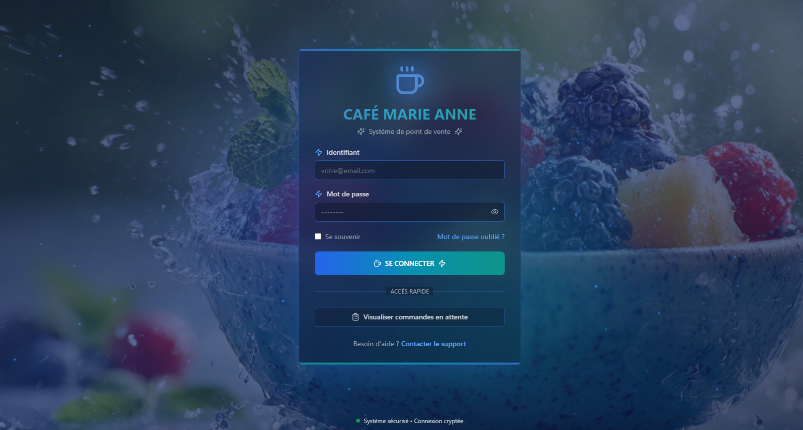
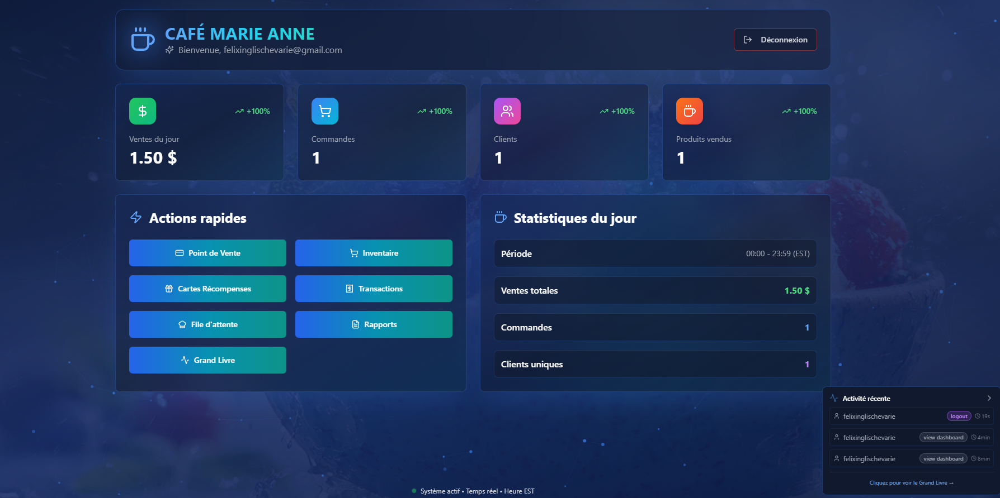
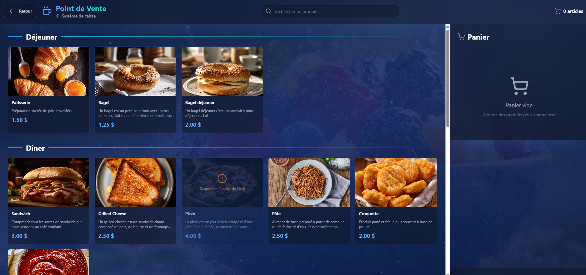
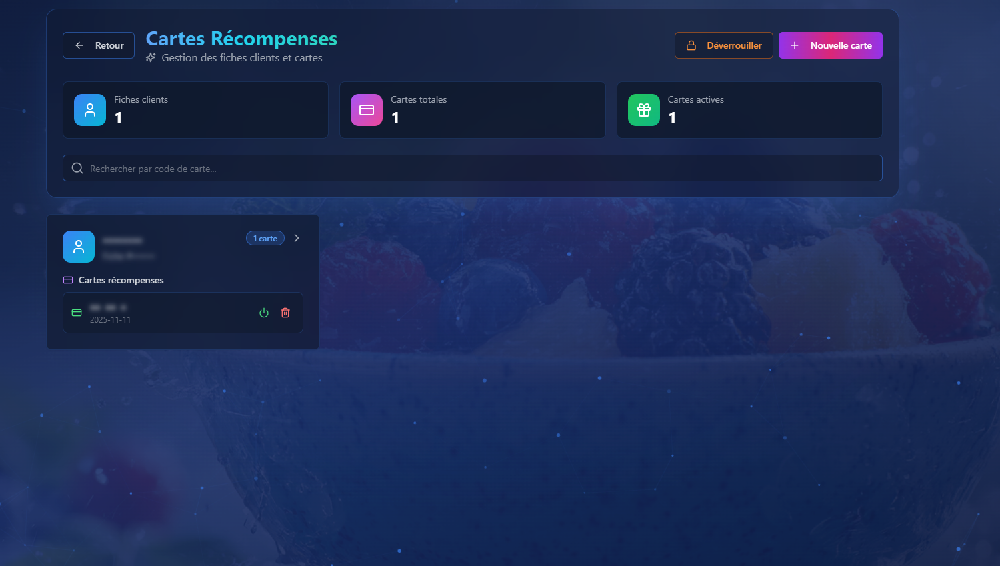
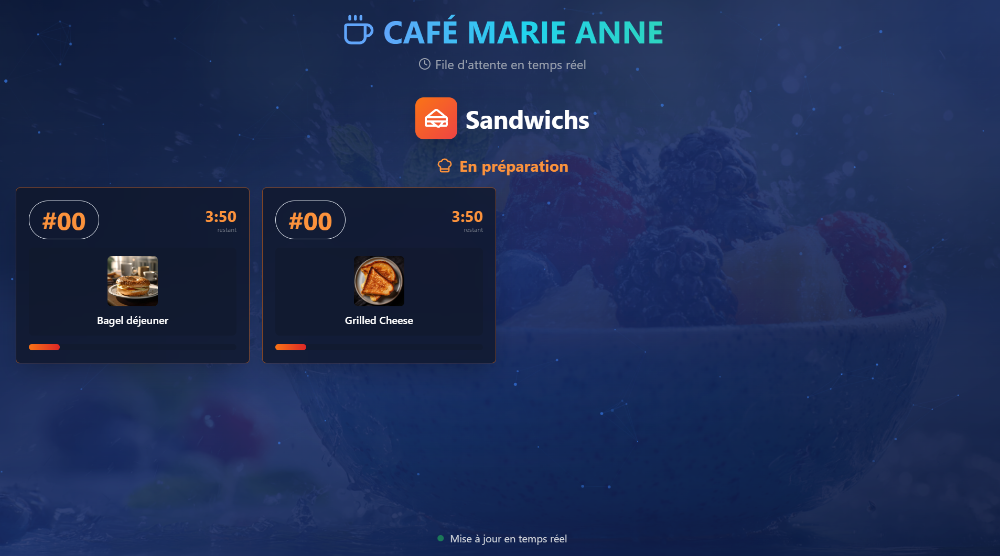

# ☕ Café Marie Anne - Système de Gestion

<div align="center">

**Système de point de vente moderne avec gestion de cartes récompenses et file d'attente de préparation**

[](https://reactjs.org/)
[](https://www.typescriptlang.org/)
[](https://supabase.com/)
[](https://tailwindcss.com/)

[🚀 Voir le logiciel](https://www.cafemarieanne.ca/) • [📖 Documentation](#table-des-matières) • [🐛 Signaler un bug](#)

</div>

---

## 📋 Table des matières

- [🎯 À propos du projet](#-à-propos-du-projet)
- [✨ Fonctionnalités principales](#-fonctionnalités-principales)
- [🏗️ Architecture technique](#️-architecture-technique)
- [🔒 Sécurité](#-sécurité)
- [🚀 Installation](#-installation)
- [📱 Utilisation](#-utilisation)
- [🗄️ Structure de la base de données](#️-structure-de-la-base-de-données)
- [🔐 Système de tokenisation](#-système-de-tokenisation)
- [📊 Système d'audit](#-système-daudit)
- [🎨 Interface utilisateur](#-interface-utilisateur)
- [🛠️ Technologies utilisées](#️-technologies-utilisées)
- [📝 Licence](#-licence)

---

## 🎯 À propos du projet

**Café Marie Anne** est un système de gestion complet conçu pour un café scolaire. Il combine un point de vente (POS), un système de cartes récompenses avec chiffrement AES-256-GCM, une file d'attente de préparation en temps réel, et un système d'audit complet.

### 🎓 Contexte

Ce système a été développé pour gérer efficacement les opérations d'un café dans un environnement scolaire, avec un accent particulier sur :
- La **protection des données personnelles** des élèves (Loi 25 - Québec)
- La **rapidité des transactions** pendant les heures de pointe
- La **traçabilité complète** de toutes les opérations
- La **gamification** via un système de points

---

## ✨ Fonctionnalités principales

### 🛒 Point de Vente (POS)

- ✅ Interface tactile optimisée pour tablette
- ✅ Gestion du panier en temps réel
- ✅ Calcul automatique des taxes (TPS/TVQ 14.975%)
- ✅ Paiement comptant avec calculateur de monnaie
- ✅ Paiement par carte (débit/crédit)
- ✅ Validation de carte récompense avec tokens temporaires
- ✅ Attribution automatique de points (1000 points par dollar)

### 🎁 Cartes Récompenses

- ✅ Création de fiches clients avec chiffrement AES-256-GCM
- ✅ Génération de codes de carte avec validation Luhn (format: `XX 00 0`)
- ✅ Système de tokenisation à deux niveaux :
  - **Token permanent** (stocké sur la carte physique)
  - **Token temporaire** (5 minutes, usage unique)
- ✅ Déverrouillage par mot de passe pour voir les données sensibles
- ✅ Gestion des points de fidélité
- ✅ Activation/désactivation des cartes

### 👨‍🍳 File d'attente de préparation

- ✅ Système de numéros de commande
- ✅ Gestion de deux types de préparation :
  - **Sandwichs** : 4min 30s, max 4 simultanés
  - **Pizzas** : 13min, max 4 simultanés
- ✅ Calcul automatique du temps d'attente
- ✅ Affichage en temps réel sur écran dédié
- ✅ Statuts : En attente → En préparation → Prêt → Livré

### 📦 Gestion d'inventaire

- ✅ Catégories de produits avec drag & drop
- ✅ Produits avec images, prix, taxes
- ✅ Disponibilité par jour et plage horaire (heure EST)
- ✅ Configuration de préparation par produit
- ✅ Réorganisation par glisser-déposer

### 📊 Rapports et statistiques

- ✅ Dashboard avec statistiques du jour (heure EST)
- ✅ Comparaison avec la veille
- ✅ Génération de rapports PDF personnalisés
- ✅ Filtres par période, métrique, type de paiement
- ✅ Top 10 des produits vendus

### 🔍 Grand Livre d'audit

- ✅ Traçabilité complète de toutes les actions
- ✅ Logs horodatés avec utilisateur, action, ressource
- ✅ Filtres par action, ressource, utilisateur
- ✅ Export CSV
- ✅ Widget en temps réel (footer)

---

## 🏗️ Architecture technique

### 📐 Stack technique

```
Frontend (React + TypeScript)
    ↓
Supabase (Backend as a Service)
    ├── PostgreSQL (Base de données)
    ├── Auth (Authentification)
    ├── Storage (Images produits)
    └── Edge Functions (Chiffrement)
```

### 🗂️ Structure du projet

```
src/
├── components/          # Composants réutilisables
│   ├── ui/             # Composants shadcn/ui
│   ├── pos/            # Composants du point de vente
│   ├── inventory/      # Composants de l'inventaire
│   ├── reward-cards/   # Composants des cartes récompenses
│   └── audit/          # Composants d'audit
├── pages/              # Pages de l'application
│   ├── Index.tsx       # Page de connexion
│   ├── Dashboard.tsx   # Tableau de bord
│   ├── POS.tsx         # Point de vente
│   ├── Inventory.tsx   # Gestion inventaire
│   ├── RewardCards.tsx # Gestion cartes
│   ├── Transactions.tsx # Historique
│   ├── Reports.tsx     # Rapports
│   └── AuditLogs.tsx   # Grand livre
├── lib/                # Utilitaires
│   ├── crypto.ts       # Chiffrement/déchiffrement
│   ├── tokenization.ts # Gestion des tokens
│   ├── audit.ts        # Système d'audit
│   └── card-validation.ts # Validation Luhn
├── integrations/       # Intégrations externes
│   └── supabase/       # Client Supabase
└── utils/              # Fonctions utilitaires
    └── toast.ts        # Notifications
```

---

## 🔒 Sécurité

### 🛡️ Chiffrement des données (AES-256-GCM)

Toutes les données personnelles sont chiffrées **côté serveur** via une Edge Function Supabase :

#### 📊 Données chiffrées
- Numéro de fiche client
- Prénom
- Notes

#### 🔐 Processus de chiffrement

```typescript
// 1. Envoi des données à l'Edge Function
const encrypted = await encryptBatch({
  first_name: "Marie",
  customer_number: "12345"
});

// 2. Chiffrement côté serveur avec AES-256-GCM
// - Clé : 256 bits (stockée dans ENCRYPTION_KEY)
// - IV : 96 bits (généré aléatoirement)
// - Format : base64(IV + ciphertext)

// 3. Stockage en base de données
// Résultat : "a3F2c8d9e4f5g6h7i8j9k0l1m2n3o4p5..."
```

#### 🔓 Déchiffrement

Le déchiffrement nécessite :
1. ✅ **Authentification** : JWT valide
2. ✅ **Mot de passe** : Confirmation de l'utilisateur
3. ✅ **Clé de chiffrement** : Accessible uniquement côté serveur

### 🎫 Système de tokenisation (double niveau)

#### 1️⃣ Token permanent (carte physique)
- Format : `XXXX-XXXX-XXXX` (12 caractères alphanumériques)
- Stocké sur la carte physique
- Jamais exposé au client
- Utilisé pour générer des tokens temporaires

#### 2️⃣ Token temporaire (checkout)
- Durée de vie : **5 minutes**
- Usage unique
- Généré à la demande depuis le token permanent
- Invalidé après utilisation

#### 🔄 Flux de validation

```
1. Client scanne la carte physique (code Luhn: AB 12 3)
   ↓
2. Backend récupère le token permanent associé
   ↓
3. Génération d'un token temporaire (expire dans 5min)
   ↓
4. Client utilise le token temporaire pour le checkout
   ↓
5. Token marqué comme "utilisé" après paiement
```

### 🔐 Validation Luhn (codes de carte)

Les codes de carte utilisent l'algorithme de Luhn pour détecter les erreurs de saisie :

```typescript
// Format : XX 00 0
// - XX : 2 lettres (dérivées du numéro de fiche)
// - 00 : 2 chiffres (numéro de fiche)
// - 0  : 1 chiffre de contrôle (Luhn)

// Exemple : AB 12 3
// - AB : Lettres générées
// - 12 : Numéro de fiche
// - 3  : Check digit Luhn
```

### 🔍 Row Level Security (RLS)

Toutes les tables Supabase ont des politiques RLS activées :

```sql
-- Exemple : Table products
ALTER TABLE products ENABLE ROW LEVEL SECURITY;

CREATE POLICY "products_select_policy" ON products 
FOR SELECT TO authenticated USING (auth.uid() = user_id);

CREATE POLICY "products_insert_policy" ON products 
FOR INSERT TO authenticated WITH CHECK (auth.uid() = user_id);
```

### 📝 Système d'audit complet

Chaque action est enregistrée dans le Grand Livre :

```typescript
await createAuditLog({
  action: 'CREATE_ORDER',
  resourceType: 'ORDER',
  resourceId: orderId,
  details: {
    total_amount: 25.50,
    payment_method: 'cash',
    points_earned: 25500
  }
});
```

### 🇨🇦 Conformité Loi 25 (Québec)

Le système respecte les exigences de la **Loi 25** sur la protection des renseignements personnels au Québec :

- ✅ **Minimisation des données** : Seules les données essentielles sont collectées (numéro de fiche et prénom)
- ✅ **Chiffrement** : Toutes les données personnelles sont chiffrées avec AES-256-GCM
- ✅ **Traçabilité** : Grand Livre d'audit complet de toutes les actions
- ✅ **Accès contrôlé** : Authentification requise + mot de passe pour déchiffrer
- ✅ **Durée de conservation** : Tokens temporaires expirés automatiquement nettoyés
- ✅ **Sécurité** : Row Level Security (RLS) sur toutes les tables

---

## 🚀 Installation

### 📋 Prérequis

- Node.js 18+ 
- npm ou yarn
- Compte Supabase

### 🔧 Installation locale

```bash
# 1. Cloner le repository
git clone https://github.com/votre-username/cafe-marie-anne.git
cd cafe-marie-anne

# 2. Installer les dépendances
npm install

# 3. Configurer les variables d'environnement
# Créer un fichier .env.local avec :
VITE_SUPABASE_URL=votre_url_supabase
VITE_SUPABASE_ANON_KEY=votre_cle_anon

# 4. Lancer le serveur de développement
npm run dev
```

### 🗄️ Configuration Supabase

#### 1. Créer les tables

Exécutez les migrations SQL dans Supabase SQL Editor :

```sql
-- Voir le fichier : supabase/migrations/001_initial_schema.sql
```

#### 2. Configurer l'Edge Function de chiffrement

```bash
# Déployer l'Edge Function
supabase functions deploy crypto-service

# Configurer la clé de chiffrement (256 bits)
supabase secrets set ENCRYPTION_KEY=votre_cle_256_bits
```

#### 3. Activer le Storage pour les images

```bash
# Créer le bucket "product-images"
# Configurer les politiques d'accès public
```

---

## 📱 Utilisation

### 🔐 Connexion

1. Accédez à l'application
2. Entrez vos identifiants Supabase
3. Vous êtes redirigé vers le Dashboard

### 🛒 Effectuer une vente

1. Cliquez sur **"Point de Vente"**
2. Ajoutez des produits au panier
3. Cliquez sur **"Finaliser la commande"**
4. Choisissez si le client a une carte récompense
5. Si oui, scannez/entrez le code de carte (format: `AB 12 3`)
6. Sélectionnez le mode de paiement (Comptant ou Carte)
7. Si comptant, utilisez le calculateur de monnaie
8. La commande est enregistrée et les points sont attribués

### 🎁 Créer une carte récompense

1. Allez dans **"Cartes Récompenses"**
2. Cliquez sur **"Nouvelle carte"**
3. Entrez le numéro de fiche (ex: 12345)
4. Entrez le prénom de l'élève
5. Un code de carte est généré automatiquement (ex: `AB 12 3`)
6. Un token permanent est créé en arrière-plan

### 🔓 Voir les données sensibles

1. Sur la page **"Cartes Récompenses"**
2. Cliquez sur **"Déverrouiller"** 🔒
3. Entrez votre mot de passe
4. Les données sont déchiffrées et affichées
5. Cliquez sur **"Verrouiller"** pour re-masquer

### 📊 Générer un rapport

1. Allez dans **"Rapports"**
2. Sélectionnez la période (date de début et fin)
3. Cochez les métriques à inclure
4. Cliquez sur **"Générer et imprimer le rapport"**
5. Un PDF s'ouvre dans une nouvelle fenêtre

---

## 🗄️ Structure de la base de données

### 📊 Schéma principal

```
customer_profiles (Fiches clients)
├── id (UUID)
├── customer_number (TEXT, chiffré)
├── first_name (TEXT, chiffré)
├── notes (TEXT, chiffré)
├── points_balance (INTEGER)
├── created_at (TIMESTAMP)
└── updated_at (TIMESTAMP)

reward_cards (Cartes récompenses)
├── id (UUID)
├── card_code (TEXT, unique, Luhn)
├── customer_profile_id (UUID → customer_profiles)
├── is_active (BOOLEAN)
└── created_at (TIMESTAMP)

card_tokens (Tokens de carte)
├── id (UUID)
├── reward_card_id (UUID → reward_cards)
├── token (TEXT, unique)
├── token_type (TEXT: 'permanent' | 'temporary')
├── expires_at (TIMESTAMP, nullable)
├── used_at (TIMESTAMP, nullable)
├── is_active (BOOLEAN)
└── created_at (TIMESTAMP)

orders (Commandes)
├── id (UUID)
├── order_number (INTEGER, auto-increment)
├── customer_profile_id (UUID → customer_profiles, nullable)
├── reward_card_id (UUID → reward_cards, nullable)
├── total_amount (NUMERIC)
├── payment_method (TEXT: 'cash' | 'card')
├── points_earned (INTEGER)
├── items (JSONB)
└── created_at (TIMESTAMP)

preparation_queue (File d'attente)
├── id (UUID)
├── order_id (UUID → orders)
├── queue_number (INTEGER)
├── preparation_type (TEXT: 'sandwich' | 'pizza')
├── estimated_time (INTEGER, secondes)
├── status (TEXT: 'pending' | 'ready' | 'delivered')
├── created_at (TIMESTAMP)
├── ready_at (TIMESTAMP, nullable)
└── delivered_at (TIMESTAMP, nullable)

products (Produits)
├── id (UUID)
├── category_id (UUID → categories)
├── name (TEXT)
├── description (TEXT)
├── price (NUMERIC)
├── image_url (TEXT)
├── position (INTEGER)
├── apply_taxes (BOOLEAN)
├── availability (JSONB)
├── requires_preparation (BOOLEAN)
├── preparation_type (TEXT: 'sandwich' | 'pizza')
└── created_at (TIMESTAMP)

categories (Catégories)
├── id (UUID)
├── name (TEXT)
├── position (INTEGER)
├── user_id (UUID → auth.users)
└── created_at (TIMESTAMP)

audit_logs (Grand Livre)
├── id (UUID)
├── user_id (UUID → auth.users)
├── user_email (TEXT)
├── action (TEXT)
├── resource_type (TEXT)
├── resource_id (TEXT)
├── details (JSONB)
├── ip_address (TEXT)
├── user_agent (TEXT)
└── created_at (TIMESTAMP)
```

---

## 🔐 Système de tokenisation

### 🎯 Objectif

Séparer les données sensibles (code de carte physique) des tokens utilisés pour les transactions, avec une durée de vie limitée.

### 🔄 Architecture

```
┌─────────────────────────────────────────────────────────────┐
│                    CARTE PHYSIQUE                           │
│                                                             │
│  ┌─────────────────────────────────────────────────────┐   │
│  │  Code Luhn: AB 12 3                                 │   │
│  │  (Imprimé sur la carte)                             │   │
│  └─────────────────────────────────────────────────────┘   │
│                          ↓                                  │
│              Scan/Saisie par l'utilisateur                  │
│                          ↓                                  │
│  ┌─────────────────────────────────────────────────────┐   │
│  │  Backend récupère le TOKEN PERMANENT                │   │
│  │  Format: A3B7-K9M2-P5Q8                             │   │
│  │  (Jamais exposé au client)                          │   │
│  └─────────────────────────────────────────────────────┘   │
│                          ↓                                  │
│  ┌─────────────────────────────────────────────────────┐   │
│  │  Génération TOKEN TEMPORAIRE                        │   │
│  │  Format: X1Y2-Z3A4-B5C6                             │   │
│  │  Expire dans: 5 minutes                             │   │
│  │  Usage: Unique                                      │   │
│  └─────────────────────────────────────────────────────┘   │
│                          ↓                                  │
│  ┌─────────────────────────────────────────────────────┐   │
│  │  Client utilise le token temporaire                 │   │
│  │  pour finaliser le paiement                         │   │
│  └─────────────────────────────────────────────────────┘   │
│                          ↓                                  │
│  ┌─────────────────────────────────────────────────────┐   │
│  │  Token marqué comme "utilisé"                       │   │
│  │  + Invalidation automatique                         │   │
│  └─────────────────────────────────────────────────────┘   │
└─────────────────────────────────────────────────────────────┘
```

### 🔧 Fonctions principales

```typescript
// Créer un token permanent (lors de la création de carte)
const permanentToken = await createPermanentCardToken(rewardCardId);

// Générer un token temporaire (au checkout)
const temporaryToken = await generateTemporaryToken(permanentToken);

// Valider un token temporaire (avant paiement)
const cardData = await validateTemporaryToken(temporaryToken);

// Marquer comme utilisé (après paiement)
await markTokenAsUsed(temporaryToken);

// Nettoyer les tokens expirés (cron job)
const count = await cleanupExpiredTokens();
```

---

## 📊 Système d'audit

### 🎯 Objectif

Tracer **toutes** les actions effectuées dans le système pour :
- Conformité réglementaire (Loi 25 - Québec)
- Détection de fraude
- Débogage
- Analyse d'utilisation

### 📝 Actions tracées

| Action | Description |
|--------|-------------|
| `LOGIN` | Connexion utilisateur |
| `LOGOUT` | Déconnexion utilisateur |
| `VIEW_DASHBOARD` | Accès au tableau de bord |
| `CREATE_PRODUCT` | Création d'un produit |
| `UPDATE_PRODUCT` | Modification d'un produit |
| `DELETE_PRODUCT` | Suppression d'un produit |
| `CREATE_ORDER` | Création d'une commande |
| `CREATE_REWARD_CARD` | Création d'une carte |
| `VALIDATE_TOKEN` | Validation d'un token |
| `ENCRYPT_DATA` | Chiffrement de données |
| `DECRYPT_DATA` | Déchiffrement de données |

### 🔍 Exemple de log

```json
{
  "id": "uuid",
  "user_id": "uuid",
  "user_email": "admin@cafemarieanne.com",
  "action": "CREATE_ORDER",
  "resource_type": "ORDER",
  "resource_id": "order-uuid",
  "details": {
    "total_amount": 25.50,
    "payment_method": "cash",
    "customer_profile_id": "customer-uuid",
    "points_earned": 25500
  },
  "ip_address": "192.168.1.1",
  "user_agent": "Mozilla/5.0...",
  "created_at": "2024-01-15T14:30:00Z"
}
```

### 📊 Widget en temps réel

Un widget en bas à droite affiche les 3 dernières actions en temps réel :

```
┌─────────────────────────────────────┐
│ 🔵 Activité récente                 │
├─────────────────────────────────────┤
│ 👤 admin • CREATE ORDER • 2s        │
│ 👤 admin • VALIDATE TOKEN • 15s     │
│ 👤 admin • VIEW DASHBOARD • 1min    │
├─────────────────────────────────────┤
│ Cliquez pour voir le Grand Livre →  │
└─────────────────────────────────────┘
```

---

## 🎨 Interface utilisateur

### 🎨 Design System

- **Framework** : Tailwind CSS
- **Composants** : shadcn/ui
- **Thème** : Dégradés bleu/cyan/teal sur fond sombre
- **Animations** : Transitions fluides, effets de particules
- **Responsive** : Optimisé pour tablette et desktop

### 🖼️ Captures d'écran

#### 🔐 Page de connexion


#### 📊 Dashboard


#### 🛒 Point de vente


#### 🎁 Cartes récompenses


#### 👨‍🍳 File d'attente


---

## 🛠️ Technologies utilisées

### 🎨 Frontend

| Technologie | Version | Description |
|-------------|---------|-------------|
| React | 18.3.1 | Framework UI |
| TypeScript | 5.5.3 | Typage statique |
| Vite | 6.3.4 | Build tool |
| Tailwind CSS | 3.4.11 | Framework CSS |
| shadcn/ui | Latest | Composants UI |
| React Router | 6.26.2 | Routing |
| Lucide React | 0.462.0 | Icônes |
| Sonner | 1.5.0 | Notifications |
| @dnd-kit | 6.3.1 | Drag & drop |

### 🔧 Backend

| Technologie | Version | Description |
|-------------|---------|-------------|
| Supabase | 2.81.1 | Backend as a Service |
| PostgreSQL | 15 | Base de données |
| Edge Functions | Deno | Serverless functions |
| Supabase Auth | Latest | Authentification |
| Supabase Storage | Latest | Stockage fichiers |

### 🔐 Sécurité

| Technologie | Description |
|-------------|-------------|
| AES-256-GCM | Chiffrement symétrique |
| JWT | Authentification |
| Row Level Security | Isolation des données |
| Luhn Algorithm | Validation codes de carte |

---

## 📝 Licence

Ce projet est sous licence **MIT**.

```
MIT License

Copyright (c) 2024 Café Marie Anne

Permission is hereby granted, free of charge, to any person obtaining a copy
of this software and associated documentation files (the "Software"), to deal
in the Software without restriction, including without limitation the rights
to use, copy, modify, merge, publish, distribute, sublicense, and/or sell
copies of the Software, and to permit persons to whom the Software is
furnished to do so, subject to the following conditions:

The above copyright notice and this permission notice shall be included in all
copies or substantial portions of the Software.

THE SOFTWARE IS PROVIDED "AS IS", WITHOUT WARRANTY OF ANY KIND, EXPRESS OR
IMPLIED, INCLUDING BUT NOT LIMITED TO THE WARRANTIES OF MERCHANTABILITY,
FITNESS FOR A PARTICULAR PURPOSE AND NONINFRINGEMENT. IN NO EVENT SHALL THE
AUTHORS OR COPYRIGHT HOLDERS BE LIABLE FOR ANY CLAIM, DAMAGES OR OTHER
LIABILITY, WHETHER IN AN ACTION OF CONTRACT, TORT OR OTHERWISE, ARISING FROM,
OUT OF OR IN CONNECTION WITH THE SOFTWARE OR THE USE OR OTHER DEALINGS IN THE
SOFTWARE.
```

---

## 🤝 Contribution

Les contributions sont les bienvenues ! Veuillez suivre ces étapes :

1. Fork le projet
2. Créez une branche (`git checkout -b feature/AmazingFeature`)
3. Committez vos changements (`git commit -m 'Add some AmazingFeature'`)
4. Push vers la branche (`git push origin feature/AmazingFeature`)
5. Ouvrez une Pull Request

---

## 📞 Contact

**Félix Inglis-Chevarie** - Élève secondaire 4

---

## 🙏 Remerciements

- [Supabase](https://supabase.com/) pour le backend
- [shadcn/ui](https://ui.shadcn.com/) pour les composants
- [Tailwind CSS](https://tailwindcss.com/) pour le styling
- [Lucide](https://lucide.dev/) pour les icônes
- [Vercel](https://vercel.com/) pour l'hébergement

---

<div align="center">

**Fait avec ❤️ pour Café Marie Anne**

[⬆ Retour en haut](#-café-marie-anne---système-de-gestion)

</div>