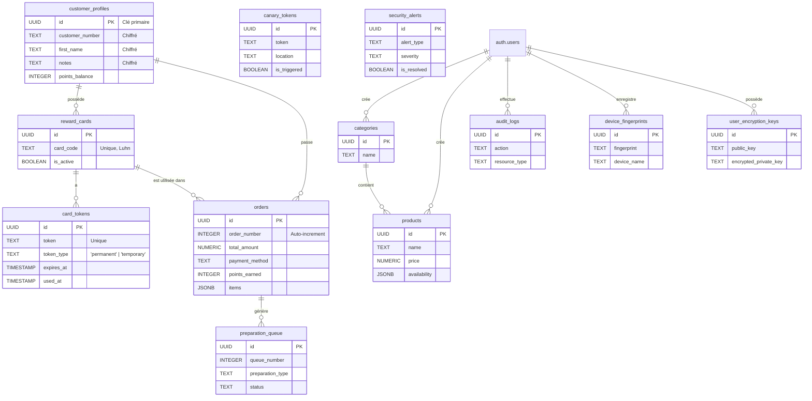

# Chapitre 5 : Schéma de Base de Données et Modèles de Données

Ce chapitre fournit une description exhaustive du schéma de la base de données PostgreSQL qui sous-tend le Système de Gestion du Café Marie Anne. Il détaille la structure de chaque table, les types de données, les contraintes, les relations et les politiques de sécurité au niveau des lignes (RLS) qui garantissent l'intégrité et la confidentialité des données.

---

## 5.1. Schéma Global de la Base de Données

Le schéma est conçu autour de plusieurs entités principales : les clients (`customer_profiles`), leurs cartes (`reward_cards` et `card_tokens`), les transactions (`orders`), le catalogue de produits (`products` et `categories`), et la sécurité (`audit_logs`, `device_fingerprints`, etc.).

---

## 5.2. Description Détaillée des Tables

### 5.2.1. Table `customer_profiles`

**Objectif :** Stocker les informations sur les clients (élèves) du programme de fidélité. Toutes les données personnelles sont chiffrées.

| Colonne | Type | Description | Contraintes / Défaut |
| :--- | :--- | :--- | :--- |
| `id` | `UUID` | Identifiant unique du profil client. | `PRIMARY KEY`, `gen_random_uuid()` |
| `customer_number` | `TEXT` | **[CHIFFRÉ]** Numéro de fiche de l'élève. | `NOT NULL` |
| `first_name` | `TEXT` | **[CHIFFRÉ]** Prénom de l'élève. | `Nullable` |
| `notes` | `TEXT` | **[CHIFFRÉ]** Notes diverses sur le client. | `Nullable` |
| `points_balance` | `INTEGER` | Solde de points de fidélité du client. | `NOT NULL`, `DEFAULT 0` |
| `created_at` | `TIMESTAMP WITH TIME ZONE` | Date de création de la fiche. | `DEFAULT now()` |
| `updated_at` | `TIMESTAMP WITH TIME ZONE` | Date de la dernière mise à jour. | `DEFAULT now()` |

**Politiques RLS :** Accès public pour permettre l'association lors de la création de commande, mais les données sensibles restent protégées par le chiffrement.

---

### 5.2.2. Table `reward_cards`

**Objectif :** Représenter les cartes de récompense physiques.

| Colonne | Type | Description | Contraintes / Défaut |
| :--- | :--- | :--- | :--- |
| `id` | `UUID` | Identifiant unique de la carte. | `PRIMARY KEY`, `gen_random_uuid()` |
| `card_code` | `TEXT` | Code alphanumérique unique (format `XX000`) visible sur la carte, validé par Luhn. | `NOT NULL`, `UNIQUE` |
| `customer_profile_id` | `UUID` | Lien vers la fiche client associée. | `NOT NULL`, `FOREIGN KEY (customer_profiles.id)` |
| `is_active` | `BOOLEAN` | Indique si la carte est active ou désactivée. | `DEFAULT true` |
| `created_at` | `TIMESTAMP WITH TIME ZONE` | Date de création de la carte. | `DEFAULT now()` |

**Politiques RLS :** Accès public pour la validation, la sécurité repose sur la non-exposition des tokens.

---

### 5.2.3. Table `card_tokens`

**Objectif :** Stocker les tokens de sécurité (permanents et temporaires) associés à chaque carte.

| Colonne | Type | Description | Contraintes / Défaut |
| :--- | :--- | :--- | :--- |
| `id` | `UUID` | Identifiant unique du token. | `PRIMARY KEY`, `gen_random_uuid()` |
| `reward_card_id` | `UUID` | Lien vers la carte récompense. | `NOT NULL`, `FOREIGN KEY (reward_cards.id)` |
| `token` | `TEXT` | La chaîne de caractères du token (format `XXXX-XXXX-XXXX`). | `NOT NULL`, `UNIQUE` |
| `token_type` | `TEXT` | Type de token : `'permanent'` ou `'temporary'`. | `DEFAULT 'permanent'` |
| `expires_at` | `TIMESTAMP WITH TIME ZONE` | Date d'expiration (pour les tokens temporaires). | `Nullable` |
| `used_at` | `TIMESTAMP WITH TIME ZONE` | Date d'utilisation (pour les tokens temporaires). | `Nullable` |
| `is_active` | `BOOLEAN` | Indique si le token est utilisable. | `DEFAULT true` |
| `created_at` | `TIMESTAMP WITH TIME ZONE` | Date de création du token. | `DEFAULT now()` |

**Politiques RLS :** Accès public. La sécurité est assurée par la courte durée de vie et l'usage unique des tokens temporaires.

---

### 5.2.4. Table `orders`

**Objectif :** Enregistrer chaque transaction effectuée au point de vente.

| Colonne | Type | Description | Contraintes / Défaut |
| :--- | :--- | :--- | :--- |
| `id` | `UUID` | Identifiant unique de la commande. | `PRIMARY KEY`, `gen_random_uuid()` |
| `order_number` | `INTEGER` | Numéro de commande séquentiel, visible par le client. | `NOT NULL`, `AUTO-INCREMENT` |
| `customer_profile_id` | `UUID` | Lien vers le client (si une carte a été utilisée). | `Nullable`, `FOREIGN KEY (customer_profiles.id)` |
| `reward_card_id` | `UUID` | Lien vers la carte (si une carte a été utilisée). | `Nullable`, `FOREIGN KEY (reward_cards.id)` |
| `total_amount` | `NUMERIC` | Montant total de la transaction (taxes incluses). | `NOT NULL` |
| `payment_method` | `TEXT` | Méthode de paiement : `'cash'` ou `'card'`. | `NOT NULL` |
| `points_earned` | `INTEGER` | Nombre de points de fidélité gagnés. | `NOT NULL`, `DEFAULT 0` |
| `items` | `JSONB` | Tableau d'objets représentant les articles vendus. | `NOT NULL` |
| `created_at` | `TIMESTAMP WITH TIME ZONE` | Date et heure de la transaction. | `DEFAULT now()` |

**Politiques RLS :** Accès public en lecture pour les statistiques, mais les informations personnelles sont liées via des UUIDs non identifiables.

---

### 5.2.5. Table `preparation_queue`

**Objectif :** Gérer la file d'attente des articles nécessitant une préparation.

| Colonne | Type | Description | Contraintes / Défaut |
| :--- | :--- | :--- | :--- |
| `id` | `UUID` | Identifiant unique de l'entrée dans la file. | `PRIMARY KEY`, `gen_random_uuid()` |
| `order_id` | `UUID` | Lien vers la commande parente. | `Nullable`, `FOREIGN KEY (orders.id)` |
| `queue_number` | `INTEGER` | Numéro affiché sur l'écran public. | `NOT NULL` |
| `preparation_type` | `TEXT` | Type de préparation : `'sandwich'` ou `'pizza'`. | `NOT NULL` |
| `estimated_time` | `INTEGER` | Temps de préparation estimé en secondes. | `NOT NULL` |
| `status` | `TEXT` | Statut : `'pending'`, `'ready'`, `'delivered'`. | `NOT NULL`, `DEFAULT 'pending'` |
| `created_at` | `TIMESTAMP WITH TIME ZONE` | Heure d'entrée dans la file. | `DEFAULT now()` |
| `ready_at` | `TIMESTAMP WITH TIME ZONE` | Heure à laquelle l'article est prêt. | `Nullable` |
| `delivered_at` | `TIMESTAMP WITH TIME ZONE` | Heure à laquelle l'article est livré. | `Nullable` |

**Politiques RLS :** Accès public en lecture pour l'affichage sur l'écran de la file d'attente.

---

### 5.2.6. Table `products`

**Objectif :** Stocker le catalogue de tous les produits vendus.

| Colonne | Type | Description | Contraintes / Défaut |
| :--- | :--- | :--- | :--- |
| `id` | `UUID` | Identifiant unique du produit. | `PRIMARY KEY`, `gen_random_uuid()` |
| `category_id` | `UUID` | Lien vers la catégorie du produit. | `Nullable`, `FOREIGN KEY (categories.id)` |
| `name` | `TEXT` | Nom du produit. | `NOT NULL` |
| `description` | `TEXT` | Description du produit. | `Nullable` |
| `price` | `NUMERIC` | Prix de base (hors taxes). | `NOT NULL` |
| `image_url` | `TEXT` | URL de l'image du produit (Supabase Storage). | `Nullable` |
| `position` | `INTEGER` | Ordre d'affichage du produit dans sa catégorie. | `NOT NULL`, `DEFAULT 0` |
| `apply_taxes` | `BOOLEAN` | Indique si les taxes s'appliquent. | `DEFAULT true` |
| `availability` | `JSONB` | Objet JSON décrivant les jours et heures de disponibilité. | `Nullable` |
| `requires_preparation` | `BOOLEAN` | Indique si le produit doit passer par la file d'attente. | `DEFAULT false` |
| `preparation_type` | `TEXT` | Type de préparation : `'sandwich'` ou `'pizza'`. | `Nullable` |
| `user_id` | `UUID` | Lien vers l'utilisateur qui a créé le produit. | `Nullable`, `FOREIGN KEY (auth.users.id)` |
| `created_at` | `TIMESTAMP WITH TIME ZONE` | Date de création. | `DEFAULT now()` |
| `updated_at` | `TIMESTAMP WITH TIME ZONE` | Date de mise à jour. | `DEFAULT now()` |

**Politiques RLS :** Les utilisateurs authentifiés ne peuvent voir, créer, modifier et supprimer que leurs propres produits.

---

### 5.2.7. Table `categories`

**Objectif :** Organiser les produits en catégories.

| Colonne | Type | Description | Contraintes / Défaut |
| :--- | :--- | :--- | :--- |
| `id` | `UUID` | Identifiant unique de la catégorie. | `PRIMARY KEY`, `gen_random_uuid()` |
| `name` | `TEXT` | Nom de la catégorie. | `NOT NULL` |
| `position` | `INTEGER` | Ordre d'affichage de la catégorie. | `NOT NULL`, `DEFAULT 0` |
| `user_id` | `UUID` | Lien vers l'utilisateur qui a créé la catégorie. | `Nullable`, `FOREIGN KEY (auth.users.id)` |
| `created_at` | `TIMESTAMP WITH TIME ZONE` | Date de création. | `DEFAULT now()` |
| `updated_at` | `TIMESTAMP WITH TIME ZONE` | Date de mise à jour. | `DEFAULT now()` |

**Politiques RLS :** Les utilisateurs authentifiés ne peuvent gérer que leurs propres catégories.

---

### 5.2.8. Table `audit_logs`

**Objectif :** Enregistrer chaque action significative effectuée dans le système pour la traçabilité.

| Colonne | Type | Description | Contraintes / Défaut |
| :--- | :--- | :--- | :--- |
| `id` | `UUID` | Identifiant unique du log. | `PRIMARY KEY`, `gen_random_uuid()` |
| `user_id` | `UUID` | Lien vers l'utilisateur ayant effectué l'action. | `Nullable`, `FOREIGN KEY (auth.users.id)` |
| `user_email` | `TEXT` | Email de l'utilisateur (pour une lecture facile). | `Nullable` |
| `action` | `TEXT` | Type d'action effectuée (ex: `CREATE_ORDER`). | `NOT NULL` |
| `resource_type` | `TEXT` | Type de ressource affectée (ex: `ORDER`). | `NOT NULL` |
| `resource_id` | `TEXT` | ID de la ressource affectée. | `Nullable` |
| `details` | `JSONB` | Données contextuelles sur l'action. | `Nullable` |
| `ip_address` | `TEXT` | Adresse IP de l'utilisateur (non utilisé actuellement). | `Nullable` |
| `user_agent` | `TEXT` | User-Agent du navigateur de l'utilisateur. | `Nullable` |
| `created_at` | `TIMESTAMP WITH TIME ZONE` | Date et heure de l'action. | `DEFAULT now()` |

**Politiques RLS :** Accès public en lecture pour le widget, mais la création est restreinte.

---

### 5.2.9. Table `device_fingerprints`

**Objectif :** Stocker les empreintes des appareils autorisés à se connecter.

| Colonne | Type | Description | Contraintes / Défaut |
| :--- | :--- | :--- | :--- |
| `id` | `UUID` | Identifiant unique de l'appareil enregistré. | `PRIMARY KEY`, `gen_random_uuid()` |
| `user_id` | `UUID` | Lien vers l'utilisateur propriétaire de l'appareil. | `NOT NULL`, `FOREIGN KEY (auth.users.id)` |
| `fingerprint` | `TEXT` | Empreinte unique générée par FingerprintJS. | `NOT NULL` |
| `device_name` | `TEXT` | Nom lisible de l'appareil (ex: "Windows - Chrome"). | `Nullable` |
| `browser_name` | `TEXT` | Nom du navigateur. | `Nullable` |
| `os_name` | `TEXT` | Nom du système d'exploitation. | `Nullable` |
| `is_active` | `BOOLEAN` | Indique si l'appareil est actuellement autorisé. | `DEFAULT true` |
| `last_used_at` | `TIMESTAMP WITH TIME ZONE` | Date de la dernière utilisation. | `DEFAULT now()` |
| `created_at` | `TIMESTAMP WITH TIME ZONE` | Date d'enregistrement de l'appareil. | `DEFAULT now()` |

**Politiques RLS :** Un utilisateur ne peut voir et gérer que ses propres appareils.

---

### 5.2.10. Table `canary_tokens`

**Objectif :** Stocker les tokens "pièges" (sentinelles) pour détecter le scraping.

| Colonne | Type | Description | Contraintes / Défaut |
| :--- | :--- | :--- | :--- |
| `id` | `UUID` | Identifiant unique du token. | `PRIMARY KEY`, `gen_random_uuid()` |
| `token` | `TEXT` | La chaîne du token (ex: `CANARY_...`). | `NOT NULL`, `UNIQUE` |
| `location` | `TEXT` | Endroit où le token a été placé (ex: `dashboard`). | `NOT NULL` |
| `is_triggered` | `BOOLEAN` | Indique si le token a été déclenché. | `DEFAULT false` |
| `triggered_at` | `TIMESTAMP WITH TIME ZONE` | Date du déclenchement. | `Nullable` |
| `triggered_by_ip` | `TEXT` | IP ayant déclenché le token. | `Nullable` |
| `triggered_by_user_agent` | `TEXT` | User-Agent ayant déclenché le token. | `Nullable` |
| `created_at` | `TIMESTAMP WITH TIME ZONE` | Date de création du token. | `DEFAULT now()` |

**Politiques RLS :** Accès public pour permettre la vérification, mais la modification est restreinte.

---

### 5.2.11. Table `security_alerts`

**Objectif :** Enregistrer toutes les alertes de sécurité générées par le système.

| Colonne | Type | Description | Contraintes / Défaut |
| :--- | :--- | :--- | :--- |
| `id` | `UUID` | Identifiant unique de l'alerte. | `PRIMARY KEY`, `gen_random_uuid()` |
| `alert_type` | `TEXT` | Type d'alerte (ex: `HONEYPOT_TRIGGERED`). | `NOT NULL` |
| `details` | `JSONB` | Données complètes sur l'événement. | `NOT NULL` |
| `severity` | `TEXT` | Niveau de gravité (ex: `CRITICAL`). | `NOT NULL` |
| `is_resolved` | `BOOLEAN` | Indique si l'alerte a été traitée. | `DEFAULT false` |
| `resolved_at` | `TIMESTAMP WITH TIME ZONE` | Date de résolution. | `Nullable` |
| `resolved_by` | `UUID` | Lien vers l'utilisateur ayant résolu l'alerte. | `Nullable`, `FOREIGN KEY (auth.users.id)` |
| `created_at` | `TIMESTAMP WITH TIME ZONE` | Date de l'alerte. | `DEFAULT now()` |

**Politiques RLS :** Seuls les administrateurs (rôle à définir) peuvent voir et gérer les alertes.

---

### 5.2.12. Table `user_encryption_keys`

**Objectif :** Stocker les clés publiques et privées (chiffrées) pour le chiffrement de bout en bout (E2E).

| Colonne | Type | Description | Contraintes / Défaut |
| :--- | :--- | :--- | :--- |
| `id` | `UUID` | Identifiant unique de l'entrée. | `PRIMARY KEY`, `gen_random_uuid()` |
| `user_id` | `UUID` | Lien vers l'utilisateur. | `NOT NULL`, `FOREIGN KEY (auth.users.id)` |
| `public_key` | `TEXT` | Clé publique RSA-4096 de l'utilisateur (format base64). | `NOT NULL` |
| `encrypted_private_key` | `TEXT` | Clé privée RSA-4096, chiffrée avec le mot de passe de l'utilisateur. | `NOT NULL` |
| `created_at` | `TIMESTAMP WITH TIME ZONE` | Date de création. | `DEFAULT now()` |
| `updated_at` | `TIMESTAMP WITH TIME ZONE` | Date de mise à jour. | `DEFAULT now()` |

**Politiques RLS :** Un utilisateur ne peut accéder qu'à sa propre ligne de clés.

---

## 5.3. Relations Entre les Tables (Clés Étrangères)

-   `customer_profiles` (1) → (N) `reward_cards`
-   `customer_profiles` (1) → (N) `orders`
-   `reward_cards` (1) → (N) `card_tokens`
-   `reward_cards` (1) → (N) `orders`
-   `orders` (1) → (N) `preparation_queue`
-   `categories` (1) → (N) `products`
-   `auth.users` (1) → (N) `categories`, `products`, `audit_logs`, `device_fingerprints`, `user_encryption_keys`

---

## 5.4. Types de Données et Contraintes

-   **`UUID` :** Utilisé pour toutes les clés primaires afin d'éviter les ID séquentiels prévisibles et de faciliter la distribution des données.
-   **`TEXT` :** Préféré à `VARCHAR` pour sa flexibilité sans perte de performance dans PostgreSQL. Utilisé pour stocker les données chiffrées en base64.
-   **`NUMERIC` :** Essentiel pour les valeurs monétaires (`price`, `total_amount`) pour garantir une précision exacte et éviter les erreurs d'arrondi des types à virgule flottante.
-   **`TIMESTAMP WITH TIME ZONE` :** Utilisé pour tous les horodatages pour stocker les dates en UTC et les convertir automatiquement au fuseau horaire correct lors de la lecture, garantissant une cohérence globale.
-   **`JSONB` :** Utilisé pour les données semi-structurées comme `orders.items` et `products.availability`. Le format binaire `JSONB` est plus efficace pour l'indexation et l'interrogation que le format `JSON` textuel.
-   **Contraintes `FOREIGN KEY` :** Utilisées systématiquement pour maintenir l'intégrité référentielle. L'option `ON DELETE CASCADE` est utilisée avec prudence (ex: la suppression d'un profil client pourrait supprimer toutes ses cartes et commandes associées).